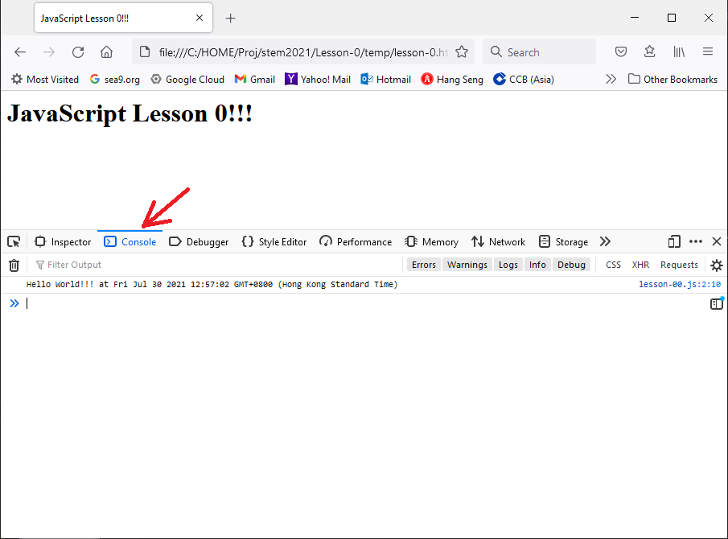

# Lesson 0 | Chapter 0

## JavaScript 是什麼？
- JavaScript 是一種腳本，也能稱它為程式語言。
- 大部份瀏覽器都支援執行 JavaScript，而絕大部份電腦都已預裝瀏覽器，因此只需要一部電腦就可以開始學習 JavaScript 編程。
- JavaScript 可以在網頁中實現出複雜的功能，初學者也能容易的編寫出很不錯的效果。

## 預備功夫

### 安裝一個文字編輯器 (Text Editor)
- Windows 中的 notepad 是一個極簡單的 Text Editor
- 建議用 Microsoft 的 [Visual Studio Code](https://code.visualstudio.com/)，免費但有足夠功能。

### 在電腦中開一個新的目錄，例如：
- `Desktop\Learn_Javascript\`

### 在這目錄中新增以下兩個檔案：
1. `lesson-0.html`
```html
<html lang="en">
	<head>
		<meta charset="utf-8"/>
		<title>
			JavaScript Lesson 0!!!
		</title>
	</head>

	<body>
		<h1>JavaScript Lesson 0!!!</h1>
	</body>

	<script src="lesson-00.js" type="text/javascript"></script>
</html>
```

2. `lesson-00.js`
```javascript
function init() {
	console.log(`Hello World!!! at ${new Date()}`);
}

window.onload = () => init();
```

### 在瀏覽器開啟 `lesson-0.html`。（建議用 Chrome 或 Firefox）

- 於瀏覽器在點選狀態下按鍵盤上的 F12，打開「開發者工具」，
- 打開 Console 分頁下可以見到當前 JavaScript 程式的執行結果。



#### >>> 嘗試刷新一下瀏覽器，有什麼改變？
> _你的答案..._

#### >>> 用哪一個 JavaScript 指令可以把文字輸出到 Console 中？
> _你的答案..._

### 注意 `lesson-0.html` 檔最後一句中 `<script>`
```html
	<script src="lesson-00.js" type="text/javascript"></script>
```

這裡的 `src` 連結了剛才的另一個檔 `lesson-00.js` 的。在後面的練習中，改變這連結就可以執行其他程式。
> 例如：寫好了 `lesson-01.js` ，把 `lesson-0.html` 最後一句改為
> ```html
> 	<script src="lesson-01.js" type="text/javascript"></script>
> ```
> 再刷新一下瀏覽器就可執行 `lesson-01.js`

### 進階：
- 留意 `lesson-00.js` 最後一句 `window.onload = () => init();` 意思是說在 window（指的是瀏覽器視窗）在載入的時候，就是剛打開（或剛刷新）一個網頁或 html 文件的時候，去跑一個叫做 `init()` 的東西。而這個 `init()` 就定義了在 `lesson-00.js` 的最開頭。
- 這叫做 event handler，意思是當有事件（event）發生時，告訴系統如何處理。
  - 這裡就是說：「在載入或刷新事件發生時，請跑 `init()` 這個函數（function）」
- 下一次上堂我們會認識更多 event handlers。

---

← 上一課 | [下一課 →](lesson-01.md)
