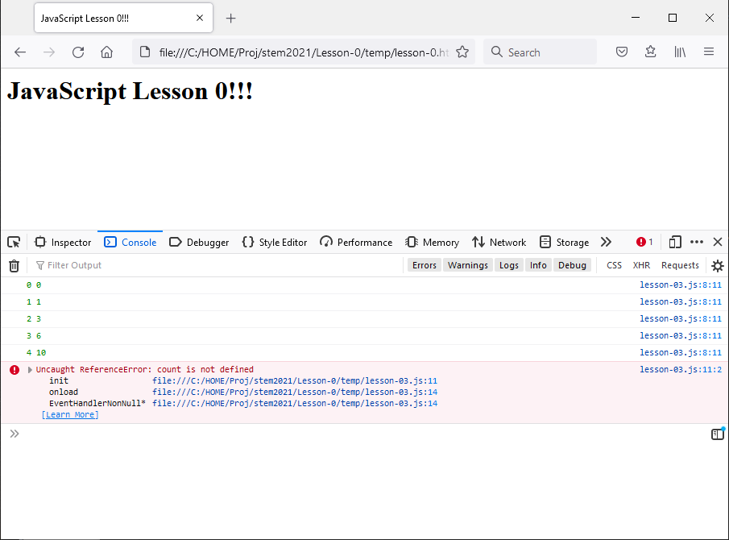

# Lesson 0 | Chapter 3

## Loop 迴圈
- Loop 也是流程控制的一種，可以把一段程式代碼重複執行的。
- 使用時要注意使 loop 停止的條件，不然形成了 infinite loop，程式就不能正常跑完。

### 最基本的叫 `while` loop，例如：
```javascript
	let count = 0; // 首先設定 count 等於 0

	// 當條件是「是」（true）的時候，執行 {...} 內的代碼，直到條件變為「非」（false）
	while (count < 5) { // 當 count 少於 5 時條件是「true」，否則為「false」
		console.log('Hello', count);
		count = count + 1; // 將 count 的值加 1，例如當 count 等於 3 時，行完這句 count 變成等於 4
	}
```
- 這程式跑出來的結果如下：
```
Hello 0
Hello 1
Hello 2
Hello 3
Hello 4
```

#### >>> 為什麼跑到 4 就停？
> _答案..._
> - 因為在最後一次跑 loop 時，`count` 等於 4，首先跑了 `console.log('Hello', count);` 得出結果 `Hello 4`。
> - 然後跑 `count = count + 1;`，這時 `count` 的值變成 5。
> - 這時 loop 返回到 `while (count < 5)`，由於這時 `count` 等於 5 （並非細過 5），所以這個 loop 會停止，繼而整個程式也停止了。

### 另一個常用的叫 `for` loop，例如：
```javascript
	for (let count = 0; count < 5; count = count + 1) {
		console.log('Hello', count);
	}
```
- 這段程式跟上面用 `while` 的功能完全一樣。它只是把分開的3句（1. `let count = 0;` 2. `count < 5` 3. `count = count + 1`）寫到 `for` 一句下面吧。

### 新增以下檔案：
- `lesson-03.js`
```javascript
function init() {
	let total = 0;
	let count = 0;

	// 計算 1 + 2 + 3 + 4 + 5 的結果
	while (count < 5) {
		total = total + count;
		count = count + 1;
		console.log(count, total);
	}

	console.log('total is', total, 'count', count);
}

window.onload = () => init();
```
- **緊記修改 `lesson-0.html` 中 `<script>` 的 `src` 連結！！！**

#### >>> 程式 `lesson-03.js` 計出的答案是錯的。錯在哪裡？如何修正？
> _答案..._
> - 它的答案錯在它事實上是計算了 0 + 1 + 2 + 3 + 4，沒有加 5。
> - 而且 loop 跑第1次時將 `total` 加上 0，是沒有意義的。
> - 可以把程式如下改：
> - `lesson-03.js`
> ```javascript
>	// 更正版本
> function init() {
> 	let total = 0;
> 	let count = 1;
> 
> 	// 計算 1 + 2 + 3 + 4 + 5 的結果
> 	while (count <= 5) {
> 		total = total + count;
> 		count = count + 1;
> 		console.log(count, total);
> 	}
> 
> 	console.log('total is', total, 'count', count);
> }
> 
> window.onload = () => init();
> ```

### 如果將 `lesson-03.js` 變成下面的樣子，會發生什麼事？試試看。
- `lesson-03.js`
```javascript
// 第2版本
function init() {
	let total = 0;

	// 計算 1 + 2 + 3 + 4 + 5 的結果
	for (let count = 0; count < 5; count = count + 1) {
		total = total + count;
		console.log(count, total);
	}

	console.log('total is', total, 'count', count);
}

window.onload = () => init();
```

#### >>> 為什麼第2版本的 `lesson-03.js` 跑出來會有這個效果？
> _答案..._
> - 最後一句會產生錯誤信息：
> 
> - 系統回錯說「`count` 沒有定義」（`count is not defined`）
> 
> ### 進階：
> - 這裡的原因是，每個變數有它的適用範圍，通常這個範圍就是最內層而又將這變數包圍著的 { 及 } 符號。
> - 在「第2版本」的例子，包圍著 `count` 的是 `for` 的 { 及 }，所以它只適用這 `for` loop 內。
> - 而在上面原來的程式， `count` 是定義在 `while` 之前，因此它適用於整個 `init()` 函數。

---

[← 上一課](lesson-02.md) | [下一課 →](lesson-04.md)
