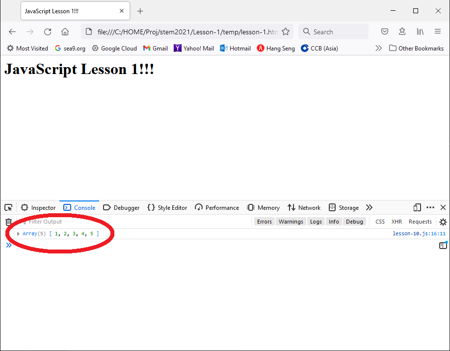

# Lesson 1 | Chapter 0

## 上期回顧
> ## JavaScript 是什麼？
> - JavaScript 是一種腳本，也能稱它為程式語言。
> - 大部份瀏覽器都支援執行 JavaScript，而絕大部份電腦都已預裝瀏覽器，因此只需要一部電腦就可以開始學習 JavaScript 編程。
> - JavaScript 可以在網頁中實現出複雜的功能，初學者也能容易的編寫出很不錯的效果。
> 
> ## 預備功夫
> 
> ### 安裝一個文字編輯器 (Text Editor)
> - 如果還未做的話，請安裝一個 Text Editor
> - 建議用 Microsoft 的 [Visual Studio Code](https://code.visualstudio.com/)，免費但有足夠功能。

### 在電腦中開一個新的目錄，例如：
- `Desktop\Lesson_01\`

### 在這目錄中新增以下兩個檔案：
1. `lesson-1.html`
```html
<html lang="en">
	<head>
		<meta charset="utf-8"/>
		<title>
			JavaScript Lesson 1!!!
		</title>
	</head>

	<body>
		<h1>JavaScript Lesson 1!!!</h1>
	</body>

	<script src="lesson-10.js" type="text/javascript"></script>
</html>
```

2. `lesson-10.js`
```javascript
function init() {
	let n = [1, 2, 3, 4, 5]; // 頭5個自然數
  console.log(n);
}

window.onload = () => init();
```

### 在瀏覽器開啟 `lesson-1.html`。（建議用 Chrome 或 Firefox）

- 於瀏覽器在點選狀態下按鍵盤上的 F12，打開「開發者工具」，
- 打開 Console 分頁下可以見到當前 JavaScript 程式的執行結果。

## 上期回顧
> ### 注意 `lesson-1.html` 檔最後一句中 `<script>`
> ```html
> 	<script src="lesson-10.js" type="text/javascript"></script>
> ```
> 
> 這裡的 `src` 連結了剛才的另一個檔 `lesson-10.js` 的。在後面的練習中，改變這連結就可以執行其他程式。
> > 例如：寫好了 `lesson-11.js` ，把 `lesson-1.html` 最後一句改為
> > ```html
> > 	<script src="lesson-11.js" type="text/javascript"></script>
> > ```
> > 再刷新一下瀏覽器就可執行 `lesson-11.js`

#### >>> `lesson-10.js` 的執行結果是什麼？
> _答案..._
> 
> 

---

← 上一課 | [下一課 →](lesson-11.md)
